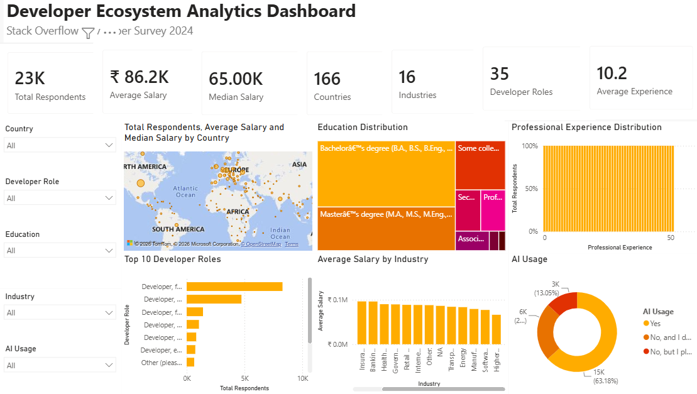

# Developer Ecosystem Analytics Dashboard

An interactive **Power BI** dashboard analysing the **Stack Overflow Developer Survey 2024** to understand how developers around the world work, what they earn, and how quickly they are adopting AI tools.



---

## Business Questions

- How does developer compensation vary by country, industry, and role?
- What is the educational background of today's developers?
- Which developer roles are most common?
- How widely are AI tools already being adopted, and who is still holding out?

---

## Dataset

| Item | Detail |
|---|---|
| Source | [Stack Overflow Developer Survey 2024](https://survey.stackoverflow.co/2024/) |
| Scope analysed | ~23K respondents who reported annual compensation |
| Coverage | 166 countries · 16 industries · 35 developer roles |
| Salary field | Annual compensation converted to USD (`ConvertedCompYearly`) |

---

## Dashboard Overview

**KPI cards:** Total Respondents · Average Salary · Median Salary · Countries · Industries · Developer Roles · Average Years of Experience

**Visuals**
- **Map:** respondents, average salary and median salary by country
- **Treemap:** education distribution
- **Bar chart:** top 10 developer roles
- **Column chart:** average salary by industry
- **Donut chart:** AI tool usage
- **Distribution chart:** professional experience

**Interactive slicers:** Country · Developer Role · Education · Industry · AI Usage. Every visual responds to every filter, so any segment (for example, *data scientists in India with a Master's degree*) can be explored in one click.

---

## Key Insights

| Metric | Value |
|---|---|
| Respondents analysed | ~23K |
| Average annual salary | ~86.2K USD |
| Median annual salary | ~65K USD |
| Average professional experience | 10.2 years |
| Developers already using AI tools | **63.2%** |
| Not using AI tools but planning to | 13.1% |

1. **AI adoption is already mainstream.** Nearly two-thirds of developers use AI tools in their workflow, and a further 13% plan to start.
2. **Average salary is well above the median** (86.2K vs 65K USD). The distribution is right-skewed, driven by a smaller group of very high earners, so the median is the more representative "typical" figure.
3. **Full-stack developers are the largest role group** by a wide margin.
4. **Bachelor's and Master's degrees together make up the large majority** of respondents' education.

---

## Tech Stack

| Layer | Tools |
|---|---|
| Data preparation | Power Query (cleaning, type fixing, filtering to salary-reporting respondents) |
| Modelling & measures | DAX (KPIs, averages, medians, distinct counts) |
| Visualisation | Power BI Desktop |

---

## How to Open

1. Install [Power BI Desktop](https://powerbi.microsoft.com/desktop/) (free, Windows).
2. Download `Developer_Ecosystem_Dashboard.pbix` from this repository.
3. Open it in Power BI Desktop and use the slicers on the left to explore.

---

## Repository Structure

```
developer-ecosystem-analytics/
├── Developer_Ecosystem_Dashboard.pbix
├── dashboard.png
└── README.md
```

---

## Author

**Sargam Hemnani**
M.Tech – Artificial Intelligence, Delhi Technological University (DTU)
[GitHub](https://github.com/Sargam208) · [LinkedIn](https://linkedin.com/in/sargam-hemnani)
